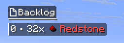

# Back-burner

A fully client-side to-do list, displayed on the side of the screen, and operated through commands.

Each world and server saves its to-do list separately.

## File locations

Data is saved as a JSON arrays of strings.

For singleplayer worlds, they are saved at the root of the world's directory as `backlog.json`

For multiplayer, they are saved under `.minecraft/remote_backlogs/`, using the ip/address and port of the server as the file name. LAN worlds are handled the same way.

## Config

The config can be edited in-game by using **Cloth-Config** and **ModMenu**.
This will let you change the position and size of the hud.

## Commands

By default, all sub-commands use `/note` as a root. The name of the root can be changed in the config screen in case of conflict.

`<text>` arguments accept both raw text and SNBT text (See Text Format below). Raw text does not need to be quoted.

`<index>` arguments also support `first` and `last` as alternatives to numeric values.

### Adding items
- `push <text>` Adds an item at the top.
- `queue <text>` Adds an item at the bottom.
- `write <text>` Adds an item to the list. (See config screen.)
- `add|insert <index> <text>` Adds an item at an arbitrary index.

### Removing items
- `pop` Removes the top-most item.
- `shift` Removes the bottom-most item.
- `pop|remove <index>` Removes the specified item. Auto-completion will show the text for the appropriate index.
- `clear` Removes everything.

### Editing
- `edit <index> <text>` Overwrites an existing item. Auto-completion will suggest the old value.
- `bump <index>` Moves an item one place upward.
- `bump <index> <offset>` Moves an item the given amount of places. Positive values move upward, negative values move downward.
- `move <from> <to>` Moves an item from one index to another.

### Hud
- `hide <bool>` Toogles the backlog hud On or Off. Can be called with no argument.

### Debug
These commands aren't required for normal usage.
- `save` Forces saving the backlog to its file. (Automatically called whenever you make any change using other commands.)
- `reload` Forces loading the backlog from its file. (Automatically called upon joining a world.)

## Text Format

Raw text is greedy and does not need to be quoted:
> `/note push I am an unquoted text`

When SNBT text is used, it can also be used in arrays, like for the description fields of Resource packs. The format has some variations with different versions of minecrafts.

Simple SNBT: 
> `/note push { text:"32x Redstone", color:red, bold:1, italic:1 }`

Partially colored text: (MC 1.21.5 and prior)
> `/note push [{text:"32x "}, {text:Redstone,color:red}]`

Partially colored text: (MC 1.21.6 and onward)
> `/note push ["32x ", {text:Redstone,color:red}]`

Text with sprites: (MC 1.21.9 and onward)
> `/note push ["32x ", {atlas:items,sprite:item/redstone}, {text:Redstone,color:red}]`

## Resource Packs

In addition to textures, resource packs can alter some minor aspects of the backlog HUD's layout, by modifying the corresponding texture's `.mcmeta` file.

- `basis`: { `width`, `height` } The base size of the element on screen.  
For 16x-packs, this is strictly equal to the texture's size. For 32x-packs, this is half the texture's size. So on, so forth.
No specific texture size is expected for these elements; the values specified here are what define the expected sizes.
- `basis`: { `fill` } (_boolean_) Whether the element should take as much horizontal space as allowed (true) or shrink to fit the text (false).
- `ninepatch`: { `top`, `bottom`, `left`, `right` } The margins of the 9-patch. I.e, the areas that won't be stretched to fit element's size.
- `padding`: { `top`, `bottom`, `left`, `right` } Empty space that will be added around the element. Negative values can be used to  remove space, and make elements overlap.
- `textarea`: { `top`, `bottom`, `left`, `right` } Margins inside the texture, which will not be filled with text.
- `text`: {...} The different colours of the text for that element, formatted as a `#aarrggbb` hex codes. The alpha component is mandatory.
	- `colour` is the text's main colour
	- `outline` defines a main outline colour.
	- `outerline` adds a thicker outline around the first outline. Requires the former to be defined.
- `text`: { `shadow` } (_boolean_) Whether the text should have a shadow. Incompatible with any outline.
